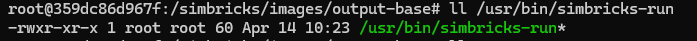

文件：docker/simbricks-run

```bash
#!/bin/bash
exec python3 /simbricks/experiments/run.py "$@"
```

推测 simbricks-run 程序本质上就是执行 python 脚本 run.py




大小仅为 60 字节


```shell
root@359dc86d967f:/simbricks/images/output-base# simbricks-run --help
usage: run.py [-h] [--list] [--filter PATTERN [PATTERN ...]] [--pickled] [--runs N] [--firstrun N] [--force] [--verbose] [--pcap] [--profile-int S] [--repo DIR] [--workdir DIR] [--outdir DIR] [--cpdir DIR]
              [--hosts JSON_FILE] [--shmdir DIR] [--parallel] [--cores N] [--mem N] [--slurm] [--slurmdir DIR] [--dist] [--auto-dist] [--proxy-type TYPE]
              EXP [EXP ...]

positional arguments:
  EXP                   Python modules to load the experiments from

options:
  -h, --help            show this help message and exit
  --list                List available experiment names
  --filter PATTERN [PATTERN ...]
                        Only run experiments matching the given Unix shell style patterns
  --pickled             Interpret experiment modules as pickled runs instead of .py files
  --runs N              Number of repetition of each experiment
  --firstrun N          ID for first run
  --force               Run experiments even if output already exists (overwrites output)
  --verbose             Verbose output, for example, print component simulators' output
  --pcap                Dump pcap file (if supported by component simulator)
  --profile-int S       Enable periodic sigusr1 to each simulator every S seconds.

Environment:
  --repo DIR            SimBricks repository directory
  --workdir DIR         Work directory base
  --outdir DIR          Output directory base
  --cpdir DIR           Checkpoint directory base
  --hosts JSON_FILE     List of hosts to use (json)
  --shmdir DIR          Shared memory directory base (workdir if not set)

Parallel Runtime:
  --parallel            Use parallel instead of sequential runtime
  --cores N             Number of cores to use for parallel runs
  --mem N               Memory limit for parallel runs (in MB)

Slurm Runtime:
  --slurm               Use slurm instead of sequential runtime
  --slurmdir DIR        Slurm communication directory

Distributed Runtime:
  --dist                Use sequential distributed runtime instead of local
  --auto-dist           Automatically distribute non-distributed experiments
  --proxy-type TYPE     Proxy type to use (sockets,rdma) for auto distribution
```

项目中对 simbricks-run 程序的解释，参数列表中的定义都可以在 run.py 中找到

解释：

#### 1. **通用实验参数**（无分组，直接添加到主解析器）

- `experiments`（必选参数）：
  位置参数，接受一个或多个字符串，表示包含实验定义的 Python 模块路径（`.py` 文件）。例如 `python run.py my_experiment.py` 中，`my_experiment.py` 即为此参数。
- `--list`：
  布尔开关，若指定，仅列出所有可用实验的名称，不实际运行。
- `--filter`：
  接受一个或多个 Unix 风格的通配符模式（如 `netperf*`），仅运行名称匹配模式的实验。
- `--pickled`：
  布尔开关，默认 `False`。若指定，将输入的 `experiments` 解析为序列化（pickled）的运行对象文件，而非 Python 模块。
- `--runs`：
  整数，默认 `1`，指定每个实验的重复运行次数。
- `--firstrun`：
  整数，默认 `1`，指定首次运行的 ID（用于区分多次重复运行的输出目录）。
- `--force`：
  布尔开关，默认 `False`。若指定，即使实验输出已存在也会强制重新运行（覆盖原有输出）。
- `--verbose`：
  布尔开关，默认 `False`。启用后输出详细日志（如各模拟器组件的运行输出）。
- `--pcap`：
  布尔开关，默认 `False`。若指定，支持的模拟器组件会生成 PCAP 数据包捕获文件。`（pcap 是数据包捕获）`

- `--profile-int`：
  整数（单位：秒），默认 `None`。若指定，将定期向每个模拟器发送 `SIGUSR1` 信号（用于性能分析）。

#### 2. **环境参数**（`Environment` 分组）

用于配置实验运行的目录、路径等环境信息：

- `--repo`：
  字符串，默认值为脚本所在目录的父目录，指定 SimBricks 仓库的根目录。
- `--workdir`：
  字符串，默认 `./out/`，指定工作目录的基础路径（用于存放临时文件）。
- `--outdir`：
  字符串，默认 `./out/`，指定输出目录的基础路径（用于存放实验结果）。
- `--cpdir`：
  字符串，默认 `./out/`，指定检查点（checkpoint）目录的基础路径（用于保存 / 恢复实验状态）。
- `--hosts`：
  字符串，默认 `None`，指定包含主机列表的 JSON 文件路径（用于分布式运行）。
- `--shmdir`：
  字符串，默认 `None`，指定共享内存目录的基础路径（未指定时使用 `workdir`）。

#### 3. **并行运行时参数**（`Parallel Runtime` 分组）

用于配置本地并行执行实验的参数：

- `--parallel`：
  布尔开关，指定后将运行时设置为 `parallel`（默认 `sequential` 串行），即本地并行执行实验。
- `--cores`：
  整数，默认值为当前进程可使用的 CPU 核心数，指定并行运行时可使用的核心数量。
- `--mem`：
  整数（单位：MB），默认 `None`，指定并行运行时的内存限制。

---

​	**下面这里的集群和分布式指的是使用多台主机共同执行 simbricks 仿真程序，而不是指一个 simbricks 仿真中模拟多 hosts 通信的场景**

#### 4. **Slurm 运行时参数**（`Slurm Runtime` 分组）

用于配置通过 Slurm 调度系统执行实验的参数（适用于集群环境）：

- `--slurm`：
  布尔开关，指定后将运行时设置为 `slurm`（默认 `sequential`），即通过 Slurm 调度实验。
- `--slurmdir`：
  字符串，默认 `./slurm/`，指定 Slurm 相关文件（如调度脚本、日志）的存放目录。

#### 5. **分布式运行时参数**（`Distributed Runtime` 分组）

用于配置分布式执行实验的参数（跨多台主机）：

- `--dist`：
  布尔开关，指定后将运行时设置为 `dist`（默认 `sequential`），即使用分布式运行时。
- `--auto-dist`：
  布尔开关，默认 `False`。若指定，会自动将非分布式实验转换为分布式（基于 `--hosts` 配置）。
- `--proxy-type`：
  字符串，默认 `sockets`，指定自动分布式时使用的代理类型（`sockets` 或 `rdma`）。

---


## 总体架构

### **一、核心概念与层级划分**

Simbricks 编排层的核心目标是**定义、组织和执行仿真实验**，整体分为三个层级：

1. **实验定义层**：描述 “要仿真什么”（如主机、网络、NIC 类型，应用场景等）。
2. **执行协调层**：负责 “如何运行仿真”（如启动顺序、依赖管理、资源调度）。
3. **模拟器交互层**：衔接上层定义与底层模拟器（如生成命令行参数、创建通信套接字路径）。

核心数据结构是 `Experiment` 类，它是所有实验的容器，包含了仿真所需的全部组件（主机、网络、NIC 等模拟器）。

### **二、实验定义：如何描述一个仿真实验？**

通过 experiments.py 中的 `Experiment` 类及其子类（如 `DistributedExperiment`）定义实验，关键要素包括：

1. **组件集合**：

   - 主机模拟器（`HostSim` 子类，如 `QemuHost`、`Gem5Host`）。
   - 网络模拟器（`NetSim` 子类，如 `SwitchNet`、`NS3BridgeNet`）。
   - 设备模拟器（`PCIDevSim` 子类，如 `I40eNIC` 网卡模拟器）。
   - 实验通过 `add_host()`、`add_network()`、`add_nic()` 等方法添加组件。

2. **实验参数**：

   - `name`：实验唯一标识，用于过滤和输出文件命名。
   - `checkpoint`：是否启用 checkpoint 加速仿真启动。
   - `no_simbricks`：是否禁用 Simbricks 适配器（仅用底层模拟器）。
   - `timeout`：实验超时时间。

3. **示例**（如 `netperf.py`）：
   通过组合不同类型的主机、网络、NIC 生成多组实验，例如：

   ```python
   e = exp.Experiment('netperf-qemu-switch-i40e')  # 实验名称
   net = sim.SwitchNet()  # 网络模拟器
   e.add_network(net)
   host = sim.QemuHost(node_config)  # 主机模拟器
   nic = sim.I40eNIC()  # NIC 模拟器
   nic.set_network(net)  # 连接 NIC 与网络
   host.add_nic(nic)
   e.add_host(host)
   e.add_nic(nic)
   ```

### **三、模拟器抽象：统一接口与具体实现**

simulators.py 定义了各类模拟器的基类，统一接口并规范交互方式：

1. **基类 `Simulator`**：
   - 核心方法：`run_cmd()`（生成启动命令）、`dependencies()`（依赖的其他模拟器）、`sockets_wait()`（需等待的套接字）等。
   - 资源需求：`resreq_cores()`、`resreq_mem()` 声明所需 CPU / 内存，用于调度。
2. **细分类型**：
   - **主机模拟器（`HostSim`）**：如 `QemuHost`、`Gem5Host`，关联 `NodeConfig`（包含 IP、应用配置等）。
   - **网络模拟器（`NetSim`）**：管理与 NIC 的连接，通过 `connect_nic()` 关联 NIC，`connect_network()` 连接其他网络。
   - **NIC 模拟器（`NICSim`）**：继承自 `PCIDevSim`，通过 `set_network()` 绑定到网络，定义 PCIe 和以太网通信参数。
3. **套接字管理**：
   - 模拟器间通过 Unix 域套接字通信，路径由 `ExpEnv`（环境变量）生成（如 `env.nic_eth_path(nic)` 生成 NIC 与网络的通信路径）。
   - `sockets_cleanup()` 定义实验结束后需清理的套接字，`sockets_wait()` 定义启动时需等待的套接字（确保依赖组件就绪）。

### **四、执行流程：从实验定义到实际运行**

runners.py 中的 `ExperimentBaseRunner` 及其子类负责执行实验，核心流程如下：

1. **准备阶段（`prepare()`）**：
   - 生成主机配置文件（如 `NodeConfig` 打包为 tar 文件）。
   - 执行模拟器的预处理命令（`prep_cmds()`），如创建工作目录、编译依赖。
2. **拓扑排序与启动（`run()`）**：
   - 通过 `sim_graph()` 构建模拟器依赖图（基于 `dependencies()` 方法）。
   - 拓扑排序后按依赖顺序启动模拟器（`start_sim()`）：
     - 生成启动命令（`run_cmd()`）并通过执行器（`Executor`）启动进程。
     - 等待依赖的套接字创建（`await_files()`），确保通信就绪。
     - 记录需等待终止的模拟器（`wait_terminate()` 标记的组件）。
3. **运行与监控**：
   - 等待标记为 “需等待” 的模拟器终止（`wait_for_sims()`）。
   - 可选：周期性发送 `SIGUSR1` 信号进行性能分析（`profiler()`）。
4. **清理与结果收集（`terminate_collect_sims()`）**：
   - 终止所有模拟器进程，清理套接字文件。
   - 收集各模拟器输出（日志、性能数据）到 `ExpOutput`。

### **五、执行器与运行时：跨环境调度**

run.py 和 exectools.py 处理实际执行环境的适配：

1. **执行器（`Executor`）**：
   - `LocalExecutor`：本地执行命令。
   - `RemoteExecutor`：通过 SSH 在远程主机执行命令。
   - 提供 `create_component()`（启动进程）、`await_files()`（等待文件创建）等方法。
2. **运行时（`Runtime`）**：
   - `LocalSimpleRuntime`：本地串行执行实验。
   - `LocalParallelRuntime`：本地并行执行（利用多核）。
   - `SlurmRuntime`：通过 Slurm 调度集群资源。
   - `DistributedSimpleRuntime`：分布式执行（跨多主机）。
3. **命令行入口（run.py）**：
   - 解析参数（实验模块、输出目录、运行时类型等）。
   - 加载实验定义，过滤并执行符合条件的实验（`--filter` 参数）。
   - 根据参数选择运行时，调用 `Runner` 执行实验。

### **六、关键协作关系**

1. **实验定义与执行的绑定**：
   - `Experiment` 描述 “做什么”，`Runner` 负责 “怎么做”，`Executor` 处理 “在哪做”。
   - 环境变量（`ExpEnv`）传递路径信息（工作目录、套接字路径等），连接定义与执行。
2. **模拟器依赖与启动顺序**：
   - 网络模拟器需等待所有关联的 NIC 启动（NIC 先创建套接字）。
   - 主机模拟器依赖其连接的 NIC 就绪（通过 `dependencies()` 声明）。
3. **分布式与代理**：
   - `DistributedExperiment` 支持跨主机分布模拟器，通过 `host_mapping` 分配组件到不同执行器。
   - 代理（`NetProxyListener`/`NetProxyConnecter`）处理跨主机通信，替换本地套接字为网络连接。

### **总结**

Simbricks 编排层通过清晰的分层设计实现了 “实验定义与执行解耦”：

- **用户**：通过组合 `Experiment`、`HostSim`、`NetSim` 等类定义仿真场景。
- **框架**：通过 `Runner`、`Runtime`、`Executor` 处理启动顺序、资源调度、跨环境执行。
- **核心纽带**：套接字路径（通信）和依赖图（启动顺序）确保各模拟器协同工作。