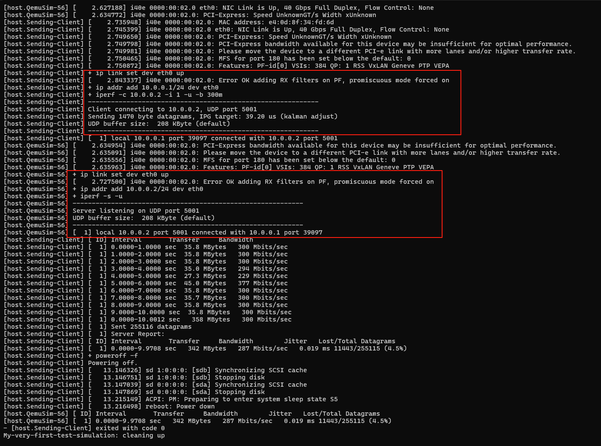

### Simbricks/Simbricks

v0.2.0 版本在 GitHub 更新截止到 2024.9.4

2025.4.15 突然开始放弃旧的 simbricks 架构，更新新的 simbricks 架构，暂且称为 v0.3

---

### Simbricks/gem5

更新截止到 2024.6.12，猜测应该是适配 v0.2.0 版本的 simbricks 代码的

镜像中 gem5 版本为  23.1.0.0

## Docker image

- simbricks/simbricks：旧版本的代码（v0.2.0），以及直接能用的 simbricks 程序和各种依赖
- simbricks/simbricks-fullsims：没有可执行的 simbricks 程序，但是有除程序之外的其他所有资源，包括磁盘镜像和编译好的外部模拟器。将 simbricks 代码 clone 下来，编译（make symphony-dev），可以运行（新代码中的 /experiment 下的 simple_demo.py 脚本）

